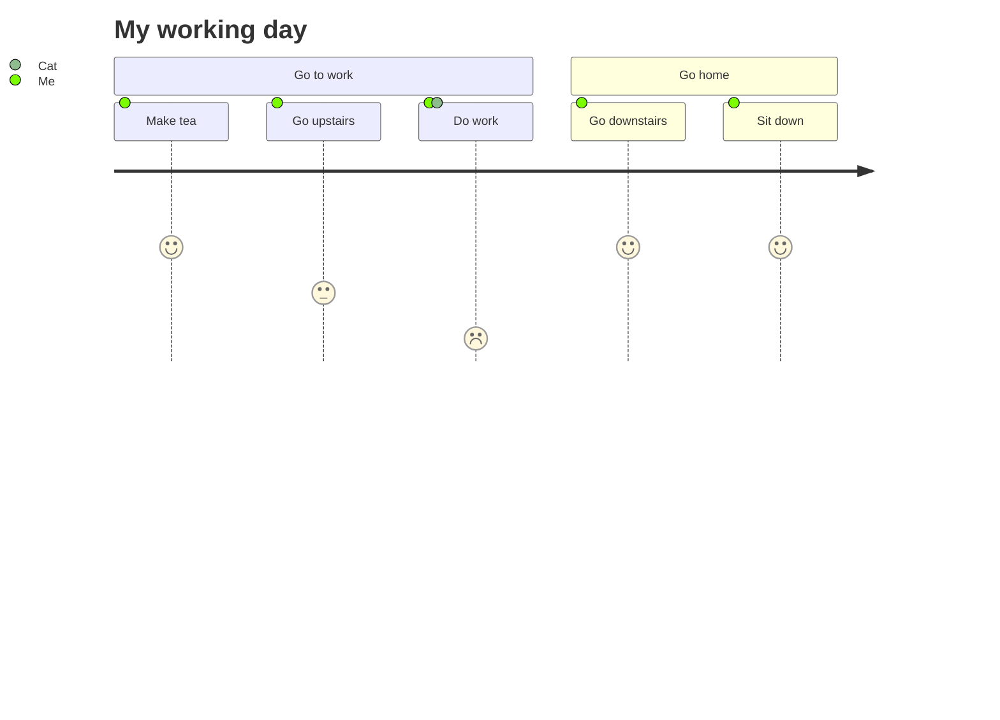

# MVC

MVC is an acronym for Model, View and Controller which is a [Design Pattern](Zettelkasten/Design%20Pattern.md) that allows you to create [[Scalable apps]], for this reason Big companies like Apple uses it. But What does it mean and how do I implement it? - Well lets start by defining what is each word in the acronym:

![[Files/Pasted image 20221027111750.png|600]]

### Model 

### View

### Controller

## References
