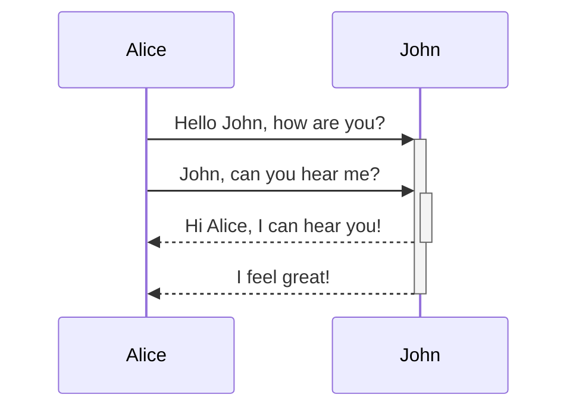

# Obsidian Diagrams

Obsidian uses under the hood a library called [Mermaid](https://mermaid-js.github.io/mermaid/#/) - which is an 

```mermaid
sequenceDiagram
    Alice->>+John: Hello John, how are you?
    Alice->>+John: John, can you hear me?
    John-->>-Alice: Hi Alice, I can hear you!
    John-->>-Alice: I feel great!
```

## References
